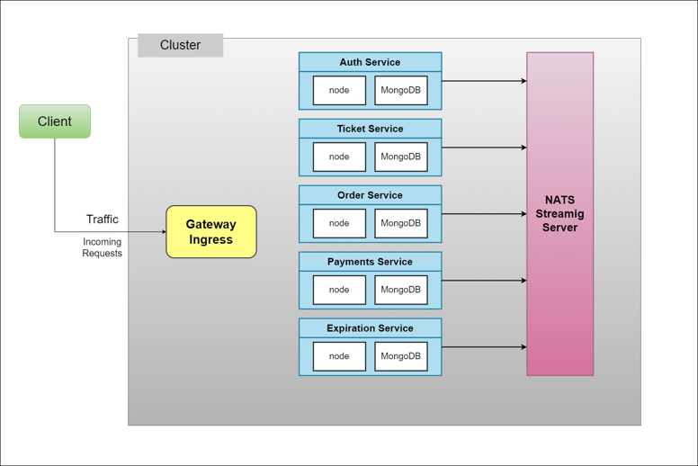

## CO4353 - Distributed Systems (Mini Project)

## Group Members (Group 7):

- Manula Gunawickrama (18/ENG/026)
- Tharuka Herath (18/ENG/031)
- Thusyanthan (18/ENG/109)
- Shathish Malgahamuduna (18/ENG/121)

## Introduction

- The ticket reservation system aims to revolutionize the way people reserve tickets for events. With this system, users will be able to reserve any kind of ticket to any event, whether it's a concert, a sports game, a theater performance, or any other type of event.

- The system will provide users with a simple, user-friendly interface that will enable them to easily search for events, select the tickets they want, and make reservations.

- By implementing this system, we aim to provide a ticket reservation experience for users, while also helping event organizers to manage their ticket sales more efficiently

### Aims & Objectives

- To develop a ticket reservation system for events
- To simplify the ticket reservation process for users
- To provide a user-friendly interface for easily search for events
- To enable users to easily select and reserve tickets for any type of event
- To assist event organizers in managing ticket sales more efficiently

## Architecture

Shown below is the architectural diagram of our project.

### Design Decisions

There are 5 Services,

- Auth Service
- Orders Service
- Payment Service
- Expiration Service
- Events-Server Service

Main design decision was to identify the core components of the system and create an seperate service for that component

## Micro Services

### Technology Stack used

**FrontEnd:**

- Next.js
- bootstrap
- language used: javascript

**BackEnd:**

- NodeJS
- Language used: typescript
- MongoDB
- Mongoose

**Implement Services**

- Docker
- Kubernetes
- NATS streaming server as a event bus
- Ingres NGINX
- Skaffold

### Core Services

Following are the core services of the project,

#### Auth Service

- Responsible for authentication task such as handling user signin, signout, and registering new users. And following are the API endpoints that it exposes,

  > POST /api/users/signin - API endpoint responsible for handling user logins

  > POST /api/users/signout - API endpoint responsible for handling user logouts

  > POST /api/users/signup - API endpoint responsible for handling new user registration

#### Orders Service

- This Service is responsible handling events happening regarding ticket buying, order cancelling, getting previous orders. And following are the API Endpoints,

  > GET /api/orders/:orderId - Return the details about a order having the ID of {orderId}

  > POST /api/orders - Add a new order to the database

  > POST /api/orders/sell/ - Handles the logic to make a ticket sale (Successfull order)

  > GET /api/orders - Get the all order currently user has maked

#### Payment Service

- This service handles the payments, and has only one API endpoint
  > POST /api/payments - Record the payment details

#### Expiration Service

- This is a utility function which supports Order Core service, main responsibility is to see if the events have been expiered or the tickets have been expiered.

#### Events Service

- Responsible for retriving a specific event, Posting ans event to the server, getting all the events.

  > GET /api/events/:eventId - Retrive a event with a specific ID

  > POST /api/events/new - Create a new event

  > GET /api/events - Get all the events

### API Gateway

As the API Gateway we have used Ingress NGINX as the API Gateway service in our project. And shown in the below figure is the configuration we provided for the ingress NGINX service when we initialize it as a kubernetes service.

### User Interface

A simple user interface is ceated using the Mainly using the NextJS. and the rest of the technologies mentioned in the Technology stack

### API Testing tools

While developing Each Express Apps to check whether the relavant API Endpoints are working as they should be we used the API Testing tool **PostMan**.

## Deployement

- We can deploy this on a any cloud enviorement after setting the necessary Kubernetes enviorement in those virtual machines.

## Future Improvements

- Since the application only support to buy one ticket at the moment, an future implementation can be to adding the functionality of buying multiple tickets at a time.

## References

About [Docker](https://www.docker.com/get-started/)
About [Kubernetes](https://kubernetes.io/docs/tasks/tools/)
About [Skaffold](https://skaffold.dev/docs/quickstart/)
About [Ingress NGINX](https://kubernetes.github.io/ingress-nginx/deploy/)
About [NextJS](https://nextjs.org/docs)
About [NATS Streaming Server](https://github.com/nats-io/nats-streaming-server)
